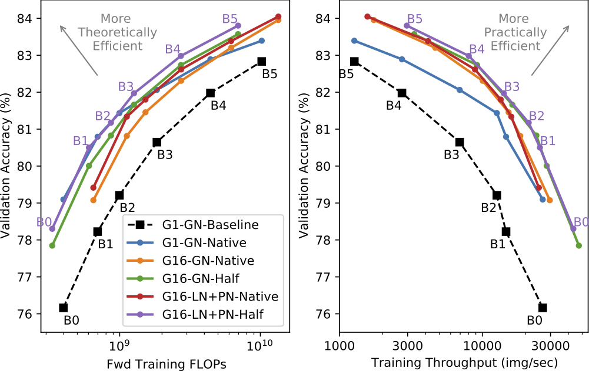

# Making EfficientNet More Efficient

This repository details how to reproduce the experiments from the paper **"Making EfficientNet More Efficient: Exploring Batch-Independent Normalization, Group Convolutions and Reduced Resolution Training"** by Dominic Masters, Antoine Labatie, Zach Eaton-Rosen and Carlo Luschi 

https://arxiv.org/abs/2106.03640

### 1. Paper Summary

This work investigates three techniques to improve the practical training and inference throughput of the
popular model EfficientNet [1].

***Adding Group Convolutions***
We expand the depthwise convolutions to group convolutions with group size 16 and reduce the MBconv the expansion ratio to keep approximately equal FLOPs. [**G1** (baseline) vs **G16** (ours)]

***Using Proxy Normalization*** To retain batch norm performance without the need for batch dependent statistics we use the recently developed Proxy Norm [2] in conjunction with Layer Norm. We compare this to a baseline implentation using Group Norm. [**GN** (baseline) vs **LN+PN** (ours)]

***Half Resolution Training*** To reduce training FLOPs we use images of half the total pixel count of the *native* resolution used in [1].

| Model Size | Native Resolution | Half Resolution |
|------------|-------------------|-----------------|
| B0         | 224               | 160             |
| B1         | 240               | 176             |
| B2         | 260               | 192             |
| B3         | 300               | 204             |
| B4         | 380               | 252             |
| B5         | 456               | 328             |

For all results (apart from the baseline) we finetune the final model on the validation image sizes for 2 epochs before testing.



### 2. Hardware and Environment Setup

This repo describes how to reproduce all the experiments on a[Graphcore POD16 server](https://www.graphcore.ai/products/mk2/ipu-pod16).

This repo has been designed to run with poplar SDK v2.1 (also works on v2.2) and uses Tensorflow v1. Note that the results in the paper use SDK v2.0 so throughput measurements may differ slightly.

The poplar SDK can be downloaded [here](https://downloads.graphcore.ai) (a support account is required).

A full overview of the SDK and instructions for installation can be found [here](https://docs.graphcore.ai/projects/sdk-overview).

Further information can also be found in our [documentation](https://docs.graphcore.ai) and on our [Developer Portal](https://www.graphcore.ai/developer)

### 3. Code

All the code to replicate the experiments in the paper has been upstreamed to the CNN training part of our main examples repository https://github.com/graphcore/examples/tree/master/applications/tensorflow/cnns/training. Information on the code, structure and examples that can be run are found in the associated
[Readme](https://github.com/graphcore/examples/blob/master/applications/tensorflow/cnns/training/README.md).


### 4. Training

To specify the options for training (with `train.py`) or validation (with `validation.py`) you can either use command line arguments, configurations defined in a `.yml` file or a mix of both.

##### Environment Variables

To run the training commands a number of environment variables need to be set:

```bash
export REPO=%PATH_TO_GRAPHCORE_EXAMPLES%/applications/tensorflow/cnns/training 
export DATA_DIR=%PATH_TO_IMAGENET_DATASET%
export CONFIG_PATH=%PATH_TO_THIS_REPO%/config.yml
```

##### Configs

In the `config.yml` configurations to complete all the main experiments in the paper are included. They are organised in the format `B${MODEL_SIZE}-G${GROUP_CONV_SIZE}-${NORM_METHOD}-${TRAINING_RESOLUTION}_16IPU_${NUM_REPLICAS}x${NUM_PIPELINE_STAGES}` 
```bash
B0-G1-GN-Native_16IPU_2x8
B1-G1-GN-Native_16IPU_4x4
B2-G1-GN-Native_16IPU_4x4
B3-G1-GN-Native_16IPU_4x4
B4-G1-GN-Native_16IPU_4x4
B5-G1-GN-Native_16IPU_4x4

B0-G16-GN-Native_16IPU_2x8
B1-G16-GN-Native_16IPU_2x8
B2-G16-GN-Native_16IPU_4x4
B3-G16-GN-Native_16IPU_4x4
B4-G16-GN-Native_16IPU_4x4
B5-G16-GN-Native_16IPU_4x4

B0-G16-GN-Half_16IPU_2x8
B1-G16-GN-Half_16IPU_4x4
B2-G16-GN-Half_16IPU_4x4
B3-G16-GN-Half_16IPU_4x4
B4-G16-GN-Half_16IPU_4x4
B5-G16-GN-Half_16IPU_4x4

B0-G16-LN_PN-Native_16IPU_2x8
B1-G16-LN_PN-Native_16IPU_2x8
B2-G16-LN_PN-Native_16IPU_4x4
B3-G16-LN_PN-Native_16IPU_4x4
B4-G16-LN_PN-Native_16IPU_4x4
B5-G16-LN_PN-Native_16IPU_4x4

B0-G16-LN_PN-Half_16IPU_2x8
B1-G16-LN_PN-Half_16IPU_4x4
B2-G16-LN_PN-Half_16IPU_4x4
B3-G16-LN_PN-Half_16IPU_4x4
B4-G16-LN_PN-Half_16IPU_4x4
B5-G16-LN_PN-Half_16IPU_4x4
```

##### Running Without PopRun

To run any of these cases without [poprun](https://github.com/graphcore/examples/blob/master/applications/tensorflow/cnns/training/README.md#popdist-and-poprun---distributed-training-on-ipu-pods) you can simply run the following command where `$CASE` is one of the above config options 
```bash
python $REPO/train.py --config-path=$CONFIG_PATH --config $CASE
```

In many cases however these runs can be bound by input pipeline overheads to do with tensorflow and python.

##### Running With PopRun

To overcome these issues and fully utilise the available CPU power, for maximum throughput poprun should be used. This runs multiple python instances which can each by pinned to separate NUMA nodes. This greatly improves the overall CPU utilisation.

For this command the `${NUM_REPLICAS}` and `${NUM_PIPELINE_STAGES}` values are given in the `$CASE` name.
```bash
poprun --numa-aware=yes --num-replicas=${NUM_REPLICAS} --ipus-per replica=${NUM_PIPELINE_STAGES} --num-instances=${NUM_REPLICAS}  --only-output-from-instance 0 python $REPO/train.py --config-path=$CONFIG_PATH --config $CASE --no-validation
```

However when running with poprun, validation must be run separately afterwards as it uses a different configuration of replicas. Here `$RESTORE_PATH` should be the directory containing the generated checkpoint files, typically `$WORKING_DIR/logs/EfficientNet.../`.
```bash
python $REPO/validation.py --config-path=$CONFIG_PATH --config $CASE --restore-path=$RESTORE_PATH 
```
porun can also be used here by prepending this command with 
```bash
poprun -v --numa-aware 1 --num-instances 8 --num-replicas 16 --ipus-per-replica 1 --only-output-from-instance 0
```

### 5. Finetuning

To finetune the final model to a new image size you need to training the last few layers for a further 2 epochs, with the same preprocessing as validation. As there is very little backprop need, this is much cheaper in terms of both memory and compute. We can therefore typically fit it on a single IPU and replicate 16 times to use all available IPUs.

- `$RESTORE_PATH` should take the same value as above
- `$IMAGE_SIZE` should be chosen such that `training_image_size % 32 == finetuning_image_size % 32` for the best 
results (see section 3.3 in paper for why) 
- `$BATCH_SIZE` should be chosen on such that it fits in memory
- `$GRAD_ACC` should be chosen such that `BATCH_SIZE * REPLICAS * GRAD_ACC = GLOBAL_BATCH_SIZE = 512`

```bash
python $REPO/train.py --config-path=$CONFIG_PATH --config $CASE --batch-size=$BATCH_SIZE --image-size=$IMAGE_SIZE --gradient-accumulation-count=$GRAD_ACC --init-path=${RESTORE_PATH}/ckpt/weight_avg_exp_0.97 --replicas=16 --shards=1 --lr-schedule=cosine --epochs=2 --train-with-valid-preprocessing --base-learning-rate=-11 --variable-filter Top
```

To finetune more layers of the model add `block7` and/or `block6` to the `--variable-filter` list.